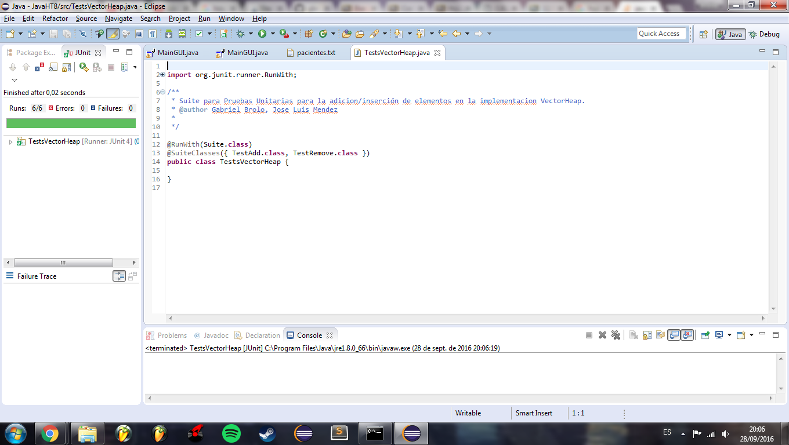

# Hospital-UVG
Hoja de Trabajo 8. Algoritmos y Estructuras de Datos. Universidad del Valle de Guatemala, 2016.

# Autores:
Gabriel Brolo (15105), José Luis Méndez (15024)
Sección: 30

# JUnit 
Version Utilizada: 4.12
Pruebas JUnit:

# Versiones del programa
Este programa cuenta con dos implementaciones en dos lenguajes, Java y Scala.
